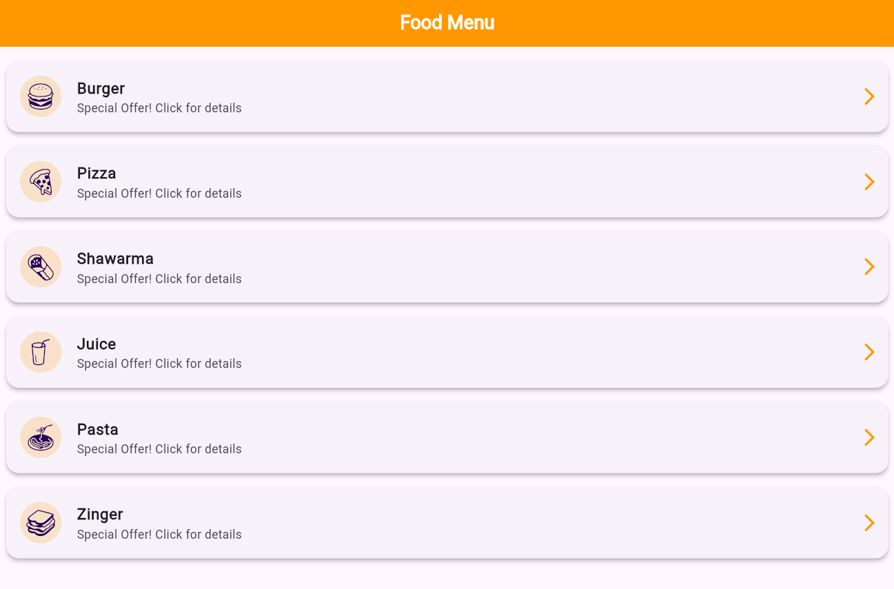
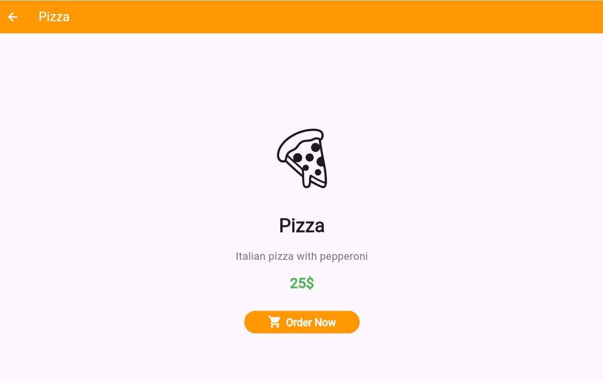
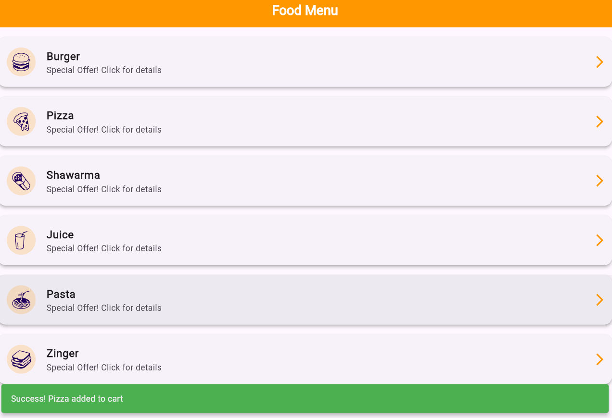

# 📱 Food Delivery Architecture - Flutter Implementation

### 👤 Developer Profile
* **الاسم:** نور زكريا أحمد
* **التخصص:** تقنية المعلومات (IT)
* **المستوى:** الثالث (Level 3)

---

## 🏛 نظرة عامة (Architecture Overview)
مشروع تقني متخصص يهدف إلى محاكاة أنظمة طلب الطعام، تم تنفيذه باستخدام **Flutter Framework**. يركز التطبيق على معالجة الـ **Dynamic Routing** وإدارة مكدس الواجهات (**Stack Management**) لضمان تجربة مستخدم سلسة واستجابة نظام عالية الكفاءة.

---

## 🛠 الجوانب البرمجية المنفذة (Technical Implementation)

* **Navigation Logic:** الاعتماد على الـ `Navigator API` لإدارة عمليات الانتقال (`Push`) والعودة (`Pop`) وتصفية الذاكرة برمجياً.
* **Data Flow:** تمرير كائنات الوجبات (Meal Objects) كـ `Arguments` لضمان عرض المحتوى الديناميكي بناءً على اختيار المستخدم.
* **Interactive UI:** بناء واجهات مستخدم معيارية (Modular UI) باستخدام `Cards` و `Slivers` مع دعم كامل لـ `Material Design 3`.
* **State Notifications:** توظيف الـ `ScaffoldMessenger` لتقديم تغذية راجعة فورية (Feedback) للمستخدم.

---

## 📸 التوثيق المرئي للمخرجات (System Screenshots)

### 01. الواجهة الرئيسية (Entry Point)

> **Technical Note:** تم استخدام `ListView.builder` لتحقيق أداء عالٍ (High Performance) عند عرض الوجبات.

### 02. تفاصيل البيانات (Core Details)

> **Technical Note:** واجهة تفصيلية تستقبل البيانات الممررة وتعرضها بأسلوب هندسي متناسق.

### 03. استجابة النظام (Action Confirmation)

> **Technical Note:** توضيح لآلية عمل الـ `SnackBar` البرمجية التي تظهر كرسالة تأكيد فورية بعد العودة للواجهة الأم.

---

## 💻 بيئة العمل (Tech Stack)
* **Language:** Dart 3.3+
* **Environment:** VS Code / Flutter SDK
* **Principles:** Clean Code & SOLID Principles (Simplified)

---
*تم إعداد هذا المستند التقني كجزء من متطلبات التقييم لمادة تطبيقات الموبايل.*
